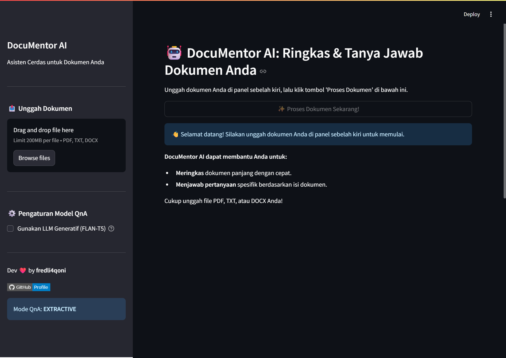
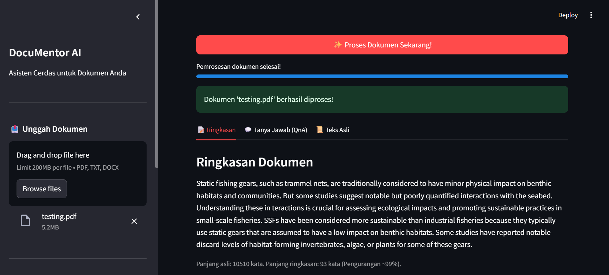
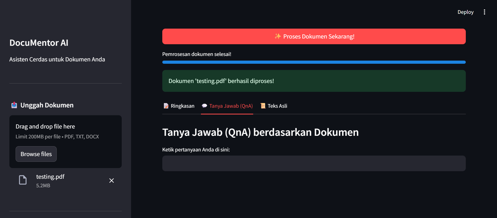

# 🤖 DocuMentor AI: Document Summarizer & QnA Bot

  <em>Asisten cerdas untuk meringkas dokumen dan menjawab pertanyaan Anda .</em>

  <!-- Badge Teknologi -->
  
  
   
  
  
   
  
  
   

---

DocuMentor AI adalah aplikasi berbasis Python dan Streamlit yang dirancang untuk merevolusi cara Anda berinteraksi dengan dokumen panjang. Unggah file PDF, TXT, atau DOCX Anda, dan biarkan AI bekerja untuk Anda!

## ✨ Fitur Utama

- 📄 **Ekstraksi Teks Universal**: Mendukung format PDF, TXT, dan DOCX.
- ✍️ **Peringkasan Cerdas**: Dapatkan ringkasan otomatis yang akurat dan ringkas dari konten dokumen Anda menggunakan model AI canggih dari Hugging Face.
- 💬 **Tanya Jawab Interaktif (QnA)**: Ajukan pertanyaan dalam bahasa alami dan dapatkan jawaban yang relevan berdasarkan isi dokumen. Didukung oleh RAG (Retrieval Augmented Generation) menggunakan LangChain:
  - Pembagian teks menjadi _chunks_ yang optimal.
  - Pembuatan _embedding_ semantik dengan Sentence Transformers.
  - Pencarian kemiripan cepat menggunakan _vector store_ FAISS.
  - Pilihan antara LLM generatif lokal atau model QnA ekstraktif untuk fleksibilitas dan performa.
- 🎨 **Antarmuka Pengguna Intuitif**: Dibangun dengan Streamlit untuk pengalaman pengguna yang mulus dan interaktif.
- 🔧 **Konfigurasi Fleksibel**: Pilih mode QnA (generatif atau ekstraktif) sesuai kebutuhan dan sumber daya Anda.

## 🚀 Demo Singkat

Berikut adalah beberapa tampilan aplikasi DocuMentor AI:

<strong>▶️ Tampilan Utama (Klik untuk lihat)</strong>

  
  <em>Tampilan antarmuka utama dengan opsi unggah dokumen di sidebar.</em>

<strong>▶️ Fitur Hasil Ringkasan (Klik untuk lihat)</strong>

  
  <em>Contoh ringkasan yang dihasilkan dari sebuah dokumen.</em>

<strong>▶️ Interaksi QnA (Klik untuk lihat)</strong>

  
  <em>Pengguna bertanya dan mendapatkan jawaban berdasarkan konten dokumen.</em>

## 🛠️ Teknologi yang Digunakan

- **Bahasa Pemrograman**: Python 3.9+
- **Framework Web/UI**: Streamlit
- **AI & NLP**:
  - LangChain
  - Hugging Face Transformers (Summarization, Embedding, QnA Models, LLMs)
  - Sentence Transformers (untuk Embedding)
  - FAISS (Vector Store)
- **Pemrosesan Dokumen**:
  - PyMuPDF (untuk PDF)
  - python-docx (untuk DOCX)

## 🧑‍💻 Dikembangkan Oleh

**Fredli4Qoni**

---
